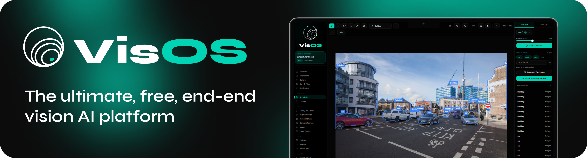
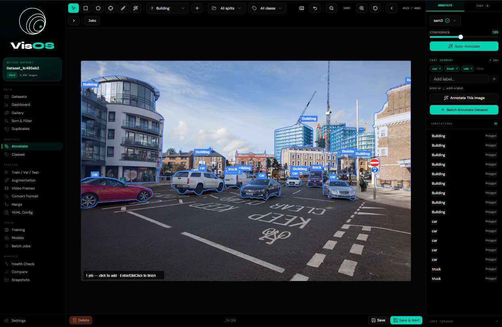
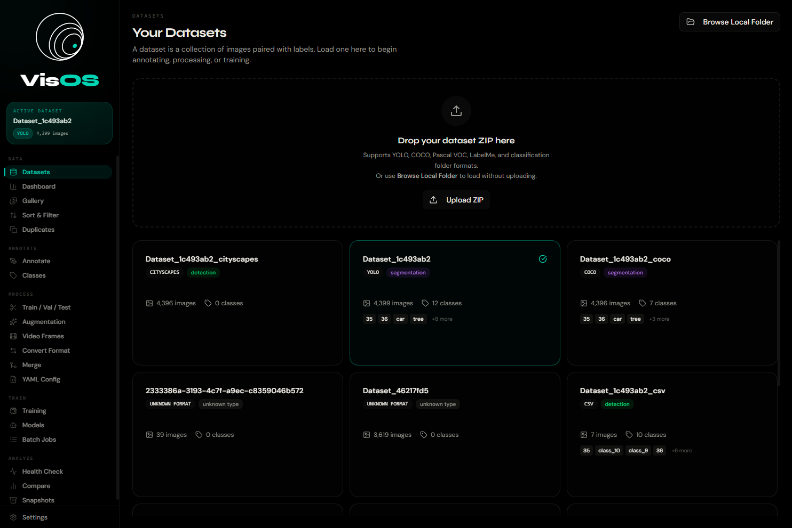
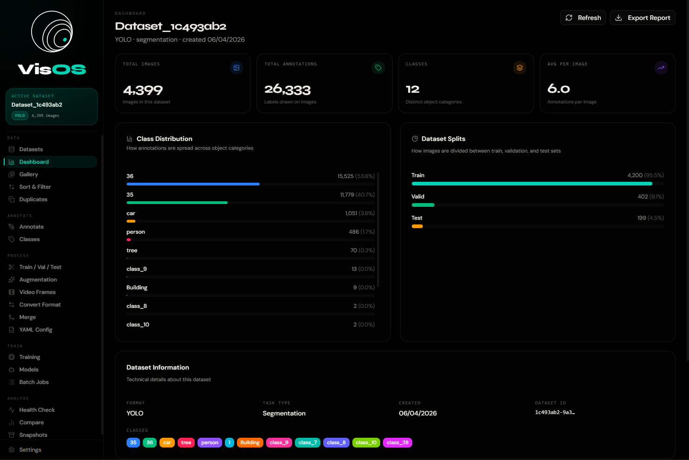
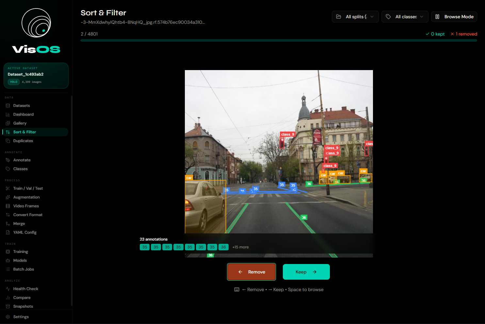
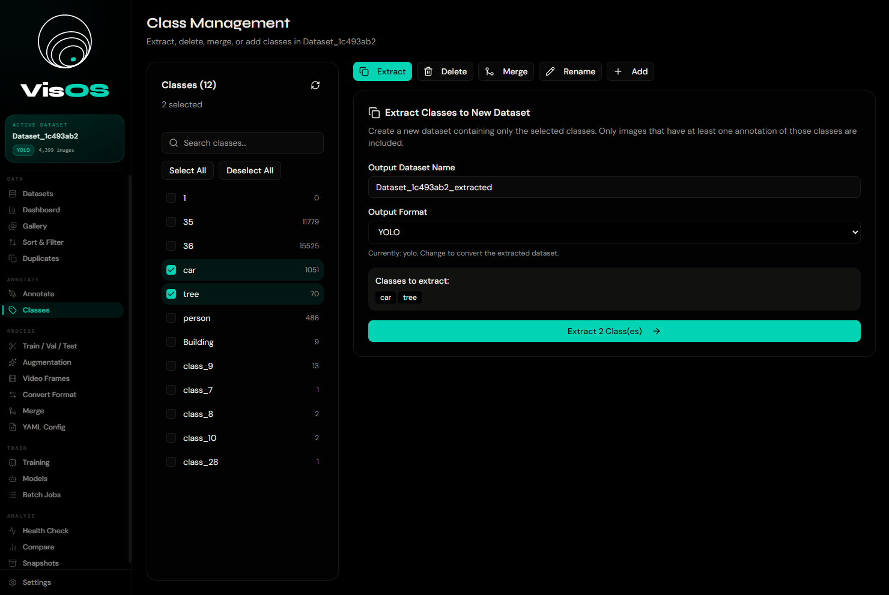
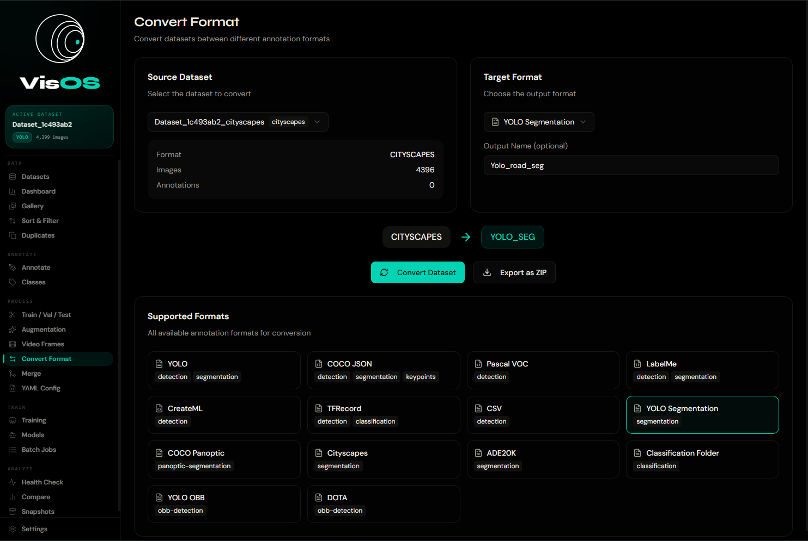
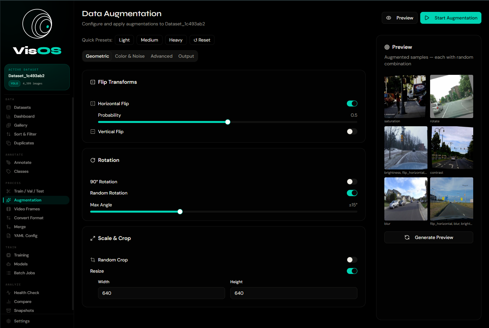

# VisOS

VisOS is a locally-run image annotation tool. No accounts, no uploads, no cloud service. Built around SAM 3 / SAM 3.1 for AI-assisted segmentation.

---



---

## Getting Started

**Prerequisites:** Python 3.10+, Node.js 18+, [uv](https://docs.astral.sh/uv/)

```bash
git clone https://github.com/Dan04ggg/VisOS.git
cd VisOS
uv run app.py
```

`app.py` creates the uv-managed environment from `pyproject.toml`, installs backend dependencies (including `sam3` from GitHub), starts the FastAPI backend on `:8000` and the Next.js frontend on `:3000`, and prints the local URL. It does not open a browser — navigate to `http://localhost:3000` yourself.

First run takes several minutes while PyTorch, transformers, and the `sam3` package download.

---

## Features

### Datasets

Load from a local folder or ZIP. Format is auto-detected on load. Datasets persist across restarts via metadata sidecar files.

**Supported formats (load & export):**  
YOLO · COCO · Pascal VOC · LabelMe · CreateML · TensorFlow CSV · ImageNet classification · YOLO OBB · COCO Panoptic · Cityscapes · ADE20K · DOTA · TFRecord



---

### Dashboard

Per-dataset overview: image count, annotation coverage, class distribution chart, train/val/test split breakdown.



---

### Sort & Filter

Review images one at a time with annotations overlaid. Keyboard-driven — right arrow to keep, left to mark for deletion. Apply bulk changes when done. Filter by annotation status or class. Shift-click for range selection.



---

### Annotation

Canvas-based editor with six tools:

| Tool | Shortcut |
|---|---|
| Select / Edit | V |
| Bounding Box | B |
| Polygon | P |
| Keypoint | L |
| Brush | R |
| SAM Wand | auto-activates when a SAM model is loaded |

Full undo/redo. Annotations save automatically.

**Auto-annotation:** load SAM 3 or SAM 3.1 and run point-prompt or text-prompt segmentation directly on your dataset. SAM 3 supports native text grounding — type a class name and it finds matching objects. Batch text-prompt jobs can be paused, resumed, and cancelled from the sidebar.

---

### Class Management

Extract, delete, merge, or rename classes without touching JSON. Shows per-class annotation counts.



---

### Format Conversion

Convert any supported format to any other. Optionally copy images alongside annotations or annotations only.



---

### Train / Val / Test Split

Split a dataset into train/val/test subsets with configurable ratios, optional stratification by class, and a fixed random seed for reproducibility. Useful when exporting a dataset for use in an external training pipeline.

---

### Augmentation

Toggle-based pipeline builder. Preview sample outputs before applying. Output to a target image count or a multiplier.

**Transforms:** horizontal/vertical flip · rotation · scale · translation · shear · perspective · random crop · brightness · contrast · saturation · hue shift · grayscale · Gaussian blur · Gaussian noise · sharpen · JPEG compression · cutout · mosaic · MixUp · elastic deformation · grid distortion · histogram equalisation · channel shuffle · invert · posterize · solarize



---

### Video Frame Extraction

Turn video files into annotatable image datasets.

- Every Nth frame
- N frames uniformly distributed across the video
- Keyframes on scene change
- Manual frame selection with scrubber

Supports MP4, AVI, MOV, MKV, WebM.


---

### Duplicate Detection

| Method | What it finds |
|---|---|
| MD5 Hash | Exact byte-for-byte duplicates |
| Perceptual Hash (pHash) | Visually similar images |
| Average Hash (aHash) | Fast approximate similarity |
| CLIP Embeddings | Semantically similar content |

Configurable similarity threshold. Keep strategy: first, largest resolution, or smallest file.

---

### Dataset Merging

Combine multiple datasets with a class-mapping UI to resolve naming conflicts before merging.


---

### Model Management

Download SAM 3 or SAM 3.1 weights from HuggingFace directly in the app. Both are gated repos — paste your HuggingFace access token on first use (stored in `localStorage`). Load and unload models to manage GPU memory.


---

### Batch Jobs

Track and manage background auto-annotation jobs. Resume interrupted jobs, preview annotated images inline, and monitor per-image progress.

---

### Additional Views

**Gallery** — grid browser with annotation overlays and full-size click-through  
**Compare** — side-by-side stats between two datasets  
**Snapshots** — save and restore named dataset states before destructive operations  
**YAML Config** — GUI editor for `data.yaml` dataset descriptors  
**Health Check** — backend API status, Python dependencies, GPU availability, workspace disk usage

---

## Usage

```bash
uv run app.py        # Start both servers
# Ctrl-C to stop.
```

No required environment variables for local use. Backend URL defaults to `http://localhost:8000` and is configurable in Settings.

---

## Architecture

```
VisOS/
├── app.py                    # uv-based launcher (backend + frontend)
├── pyproject.toml            # uv dependency manifest
├── backend/
│   ├── main.py               # FastAPI entrypoint and all routes
│   ├── dataset_parsers.py    # Format auto-detection and parsing
│   ├── format_converter.py   # Cross-format conversion
│   ├── annotation_tools.py   # Annotation read/write logic
│   ├── augmentation.py       # Augmentation pipeline engine
│   ├── dataset_merger.py     # Merge with class mapping
│   ├── model_integration.py  # SAM 3 download, load/unload, inference
│   └── video_utils.py        # Frame extraction, duplicate detection, CLIP
└── components/               # React views (one per sidebar section)
```

**Proxy pattern:** Next.js API routes in `app/api/backend/` forward all requests to FastAPI, eliminating CORS issues. The frontend only ever talks to `localhost:3000`.

**Persistence:** Datasets survive restarts via `dataset_metadata.json` sidecars. On startup the backend scans `workspace/datasets/` and re-registers everything it finds.

**Launcher:** `app.py` uses uv to provision the backend environment and spawns both the FastAPI backend and the Next.js dev server. No Docker required.

---

## API

Base URL: `http://localhost:8000/api`  
Interactive docs: `http://localhost:8000/docs`

| Resource | Endpoints |
|---|---|
| Datasets | `GET /datasets` · `POST /datasets/load-local` · `POST /datasets/upload` · `GET/DELETE /datasets/{id}` |
| Images | `GET /datasets/{id}/images` · `GET /datasets/{id}/images/{image_id}` · `PUT .../annotations` |
| Classes | `POST /datasets/{id}/extract-classes` · `/delete-classes` · `/merge-classes` |
| Conversion | `POST /datasets/{id}/convert` · `POST /datasets/merge` · `GET /formats` |
| Augmentation | `POST /datasets/{id}/augment-enhanced` |
| Video | `POST /video/extract` |
| Duplicates | `POST /datasets/{id}/find-duplicates` · `/remove-duplicates` |
| Models | `GET /models` · `POST /models/download` · `POST /models/{id}/load` · `POST /models/{id}/unload` |
| Auto-annotation | `POST /datasets/{id}/auto-annotate` · `POST /auto-annotate/{id}/text-batch` · `GET /api/auto-annotate/jobs` |
| System | `GET /api/health` |

---

## Troubleshooting

**"Backend not connected"** — Python failed to start. Check `.logs/backend.log`. Common causes: Python < 3.10, port 8000 in use, missing OpenCV system dependency, uv environment not provisioned.

**First startup hangs** — Normal. PyTorch, transformers, and the `sam3` package are large. Check `.logs/backend.log` to watch uv install progress.

**"Dataset format not recognized"** — Auto-detection looks for specific files (`data.yaml`, `instances_train.json`, `Annotations/*.xml`, etc). Match the folder structure exactly. Nested ZIPs aren't supported — extract first.

**SAM 3 download fails with 401/403** — Both `facebook/sam3` and `facebook/sam3.1` are gated on HuggingFace. Request access on the model page, generate a token at `hf.co/settings/tokens`, and paste it into the Models view on first download.

**Port still in use after crash** — Kill the process listening on the port. `lsof -ti:3000 | xargs kill -9` (macOS/Linux) or `netstat -ano | findstr :3000` → `taskkill /F /PID <pid>` (Windows).

**Blank frontend / 500** — Run `npm install` manually in the project root, then `uv run app.py`.

---

> ⚠️ The FastAPI backend serves files directly from your local filesystem. Don't expose port 8000 to the public internet without authentication. For remote GPU servers, use SSH port forwarding: `ssh -L 3000:localhost:3000 -L 8000:localhost:8000 user@server`
